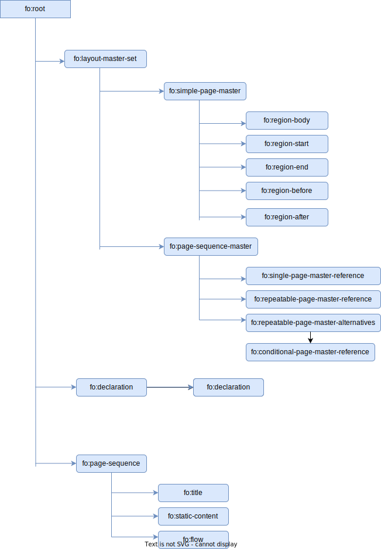

## XSL-FO Processor:

- [Apache FOP](https://xmlgraphics.apache.org/fop/)

---



---

### Links:

- https://www.w3.org/TR/xsl/
- http://www.renderx.com/tutorial.html
- http://structuredauthoring.net/xml/readings/6_Introduction_xsl_fo.html
- https://www.data2type.de/en/xml-xslt-xslfo/xsl-fo/xsl-fo-introduction/blocks
- http://www.w3big.com/xslfo/default.html
- http://www.cafeconleche.org/books/bible3/chapters/ch16.html
- https://www.antennahouse.com/xsl-fo-samples
- https://www.iro.umontreal.ca/~lapalme/ForestInsteadOfTheTrees/HTML/ch05s04.html
- https://www.netjstech.com/2015/07/how-to-create-pdf-from-xml-using-apache-fop.html
- http://www.herongyang.com/XSL-FO/
- https://docstore.mik.ua/orelly/xml/xmlnut/ch13_01.htm
- https://docs.oracle.com/cd/B40078_02/doc/bi.1013/b40017/T114602T418798.htm
- https://www.xmlpdf.com/different-first-page.html
- http://www.xmlpdf.com/builds/ibex.pdf
- https://www.data2type.de/en/xml-xslt-xslfo/xsl-fo/xsl-fo-introduction/page-layout

---

```
<?xml version="1.1" encoding="utf-8"?>
<fo:root xmlns:fo="http://www.w3.org/1999/XSL/Format1">
    <fo:layout-master-set>
        <fo:simple-page-master master-name="my_page" margin="1in">
            <fo:region-body />
        </fo:simple-page-master>
    </fo:layout-master-set>
    <fo:page-sequence master-reference="my_page">
        <fo:flow flow-name="xsl-region-body">
            <fo:block color="red" font-weight="bold" background-color="pink" padding="10pt">Hello world!</fo:block>
        </fo:flow>
    </fo:page-sequence>
</fo:root>
```

### fo:root:

The root element of all XSL-FO documents is fo:root. This element normally declares the fo prefix, which **must be** mapped to the http://www.w3.org/1999/XSL/Format namespace URI. As always, the prefix can change as long as the URI stays the same.

The fo:root element must contain two things:

- a `fo:layout-master-set` and
- a `fo:page-sequence`

### fo:layout-master-set:

Contains elements describing the overall layout of the pages themselves, that is, how large the pages are, whether they're in landscape or portrait mode, how wide the margins are.

### fo:simple-page-master:

Following are the child possible elements of the fo:simple-page-master element:

- fo:region-start
- fo:region-end
- fo:region-before
- fo:region-after
- fo:region-body

- fo:region-body is required other regions are optional.
- use extent property to set height and width of non-body element.

### fo:page-sequence:

- Page sequence is collection of pages that has same page characteristics.

- Contains the actual text that will be placed on the pages, along with the instructions for formatting.

- The formatting engine uses the layout master set to create a page. Then it adds content to the page from the fo:page-sequence until the page is full. Then it creates the next page in the sequence and places the next batch of content on that page. This process continues until all the content has been positioned.

- When formatting engine finds a page-sequence element it looks at the list of known simple-page-master and page-sequence-master elements and finds one with a master-name attribute which equals the master-reference attribute on the page-sequence.

### page-sequence:

`<fo:flow flow-name="xsl-region-body">`
`<static-content flow-name="footer">`

- flow is used add content to body.
- static-content is used to add content to header, footer or side panels.
- The order of the static-content and flow elements is important. All
  static-content elements must come before any flow elements.
- flow-name maps the region of the page where the content will be placed.
- one fo:page-sequence can not have multiple "fo:flow" declaration inside
- the content of the flow will be poured into the page body region. If the content need more space page will be added until all content of flow is exhausted.
- In order for the content contained in the flow to appear on the page, the flow-name of the flow should match a region-name of one of the regions on the page.
- Within the flow element the contents flow and are broken up into pages, if the volume exceeds the capacity of a page. The content of this element determines the line and page break and thus also the number of generated pages.
- The static-content element determines the static contents of page regions outside the region which takes the running content in. The content of these regions is not involved in page and line breaks. For example, if the content of a static-content is too big for one page, the formatter won' t generate a page break but either stop the formatting or output a warning which shows the overflow in the given region.

#### default values of flow name:

- xsl-region-body
- xsl-region-start
- xsl-region-end
- xsl-region-before
- xsl-region-after
- any custom name can be used

The fo:flow element must contain block-level formatting object elements. The most basic of these is fo:block . Others include fo:block-container , fo:list-block , fo:table , and fo:table-and-caption . We'll begin with the most basic, fo:block. A fo:block can contain a combination of raw text and formatting objects such as fo:external-graphic, fo:inline, fo:page-number, fo:footnote, and even other fo:block elements.

### Using different layouts for different pages:

It is possible to define different page layouts for different pages. This can be done in two possible ways, either by assigning different page masters to different page sequences, or by using a page-master-alternatives element which chooses from a set of simple-page-master elements based on criteria such as the current page number.


## Method 1: Using different page masters for each page sequence:

With this approach content from one single flow element always appears on pages with the same layout.

```
<layout-master-set>

<simple-page-master master-name="front-page" margin="1.5cm" page-height="297mm" page-width="210mm">
    <region-body region-name="body" margin="0.75cm 0.5cm 0.75cm 3cm"/>
    <region-before region-name="header" extent="2.5cm"/>
    <region-after region-name="footer" extent="1cm"/>
    <region-start extent="1cm" background-color="#eeeeee"/>
</simple-page-master>

<simple-page-master master-name="toc-page" margin="1.5cm" >
    <region-body column-count="1" region-name="body" margin="0.75cm 0.5cm 1cm 3cm" margin-left="2cm" margin-right="1.5cm" />
    <region-before region-name="header" extent="1cm"/>
    <region-after region-name="footer" extent="0.75cm"/>
    <region-start extent="2cm" />
    <region-end region-name="end" extent="1.5cm" />
</simple-page-master>

</layout-master-set>
```

Content is allocated to the two sections of the document using two separate page-sequences

```
<page-sequence master-reference="front-page">
    <flow flow-name="body">
        <block>
            content that appears in the body of the front page
        </block>
    </flow>
</page-sequence>
<page-sequence master-reference="toc-page">
    <flow flow-name="body">
        <block>
            content that appears in the table of contents
        </block>
    </flow>
</page-sequence>
```

When using this approach `content from one flow always appears on pages with the same layout`. Flowing content across different page layouts is described in the next section.

## Method 2: Using page master alternatives / page-sequence-master:

Often it is desirable to have content flow continuously across pages with different layouts. To make content from a `single flow element span multiple pages with different page layouts` we use a page-sequence-master element. This element contains a repeatable-page-master-alternatives element, which in turn contains a set of conditional-page-master-reference elements.

#### Page masters for three different layouts:
```
<simple-page-master master-name="chapter-odd-no-header">
    <region-body region-name="body" margin="2.5cm 2.5cm 2.5cm 4.0cm"/>
    <region-after region-name="footer-odd" extent="1.5cm" display-align="before"/>
</simple-page-master>

<simple-page-master master-name="chapter-even">
    <region-body region-name="body" margin="2.5cm 2.5cm 2.5cm 4.0cm" column-count="1"/>
    <region-before region-name="header-even" extent="1.5cm" display-align="after"/>
    <region-after region-name="footer-even" extent="1.5cm" display-align="before"/>
</simple-page-master>

<simple-page-master master-name="chapter-odd">
    <region-body region-name="body" margin="2.5cm 2.5cm 2.5cm 4.0cm"/>
    <region-before region-name="header-odd" extent="1.5cm" display-align="after"/>
    <region-after region-name="footer-odd" extent="1.5cm" display-align="before"/>
</simple-page-master>
```

#### The page-sequencemaster element:
```
<page-sequence-master master-name="chapter" >
    <repeatable-page-master-alternatives>
        <conditional-page-master-reference page-position="first" master-reference="chapter-odd-no-header"/>
        <conditional-page-master-reference odd-or-even="odd" master-reference="chapter-odd"/>
        <conditional-page-master-reference odd-or-even="even" master-reference="chapter-even"/>
    </repeatable-page-master-alternatives>
</page-sequence-master>
```

When formatting content from a page-sequence which has flow-name="chapter", fomatter engine looks at each of the conditional-page-master-reference elements and chooses which one will be active for the current page. This is done by evaluating conditions specified with the page-position attribute. As a page is created,    each conditional-page-master-reference is considered in turn, starting from the first one. The first one found whose conditions are satisfied will determine  the page master for the current page. Since alternatives are considered in the order in which they appear in the FO, the order in which the alternatives are listed is important.

When the first page of the chapter is being created, the page-position="first" condition is true, so the first conditional-page-master-reference will be chosen because it has page-position = "first". This has master-reference = "chapter-odd-no-header", so the simple-page-master with master-name = "chapter-odd-no-header" becomes the active page master for the first page of the chapter. When the second page of the chapter is being created, the page-position="first" is no longer true so the conditions on the next conditional-page-master-reference will be evaluated.


## Text formatting:

 - text-align= "justify": text is aligned against both the left and right edges of the block. Space is inserted between words to achieve this effect. Setting text-align = "justify" does not align the last line of the paragraph, this is done using text-align-last = "justify".
    
 - border:   When printed, a block may be split by a page break or a column break. What happens to the borders adjacent to the breakline? For some block types, you may want to box every part of the original block separately, i.e. draw a border line where the break occurs; this is the default behaviour in XSL FO (XSLFO). For some other blocks, you may prefer to "keep the box open" suppressing borders at column/page breaks. This behavior is controlled by a special component of the border's width — border-{side}-width.conditionality:
```
<fo:block border="thin blue groove"
          border-before-width.conditionality="discard"
          border-after-width.conditionality="discard">
  If this block happens to be split by a page break,
  no line will be drawn on either side of the break.
</fo:block>
```

## Layout example 1:
```
<?xml version="1.0" encoding="iso-8859-1"?>
<fo:root xmlns:fo="http://www.w3.org/1999/XSL/Format">
	<fo:layout-master-set>
		<fo:simple-page-master master-name="first-page">
			<fo:region-body margin="1in" border="thin silver ridge" padding="6pt"/>
		</fo:simple-page-master>
		<fo:simple-page-master master-name="all-pages">
			<fo:region-body margin="1in"/>
		</fo:simple-page-master>
		<fo:page-sequence-master master-name="my-sequence">
			<fo:single-page-master-reference master-reference="first-page"/>
			<fo:repeatable-page-master-reference master-reference="all-pages"/>
		</fo:page-sequence-master>
	</fo:layout-master-set>
	<fo:page-sequence master-reference="my-sequence">
		<fo:flow flow-name="xsl-region-body" font="72pt Times">
			<fo:block space-before="2in" space-after="2in">
				First block
			</fo:block>
			<fo:block break-before="page" space-before="2in" space-after="2in">        
				Second block
			</fo:block>
			<fo:block break-before="page" space-before="2in" space-after="2in">
				Third block
			</fo:block>
		</fo:flow>
	</fo:page-sequence>
</fo:root>
```

---

## Page sequence masters:

Each page the formatter creates is associated with a master page from the fo:layout-master-set that defines how the page will look. The master-reference attribute of the fo:page-sequence element determines which master page this is. Listings 16-3 through 16-5 used a single fo:simple-master-page named A4 to fill this role, but it is not uncommon to have more than one master page. For example, you could use one master page for the first page of each chapter, a different one for all the subsequent left-hand pages, and a third for all the subsequent right-hand pages. In this case, the master pages might be grouped as part of a fo:page-sequence-master instead.

The fo:page-sequence-master element is a child of the fo:layout-master-set that lists the order in which particular master pages will be instantiated using one or more of these three child elements:

 - fo:single-page-master-reference
 - fo:repeatable-page-master-reference
 - fo:repeatable-page-master-alternatives

The fo:single-page-master-reference and fo:repeatable-page-master-reference elements each have a master-reference attribute that specifies which fo:simple-master-page their pages are based on. The fo:repeatable-page-master-alternatives has child fo:conditional-page-master-reference elements that are instantiated based on various conditions. Each of these child fo:conditional-page-master-reference elements has a master-reference attribute that specifies which fo:simple-master-page to use if its condition is satisfied.

### fo:single-page-master-reference:

The simplest page master element is fo:single-page-master-reference whose master-reference attribute identifies one master page to be instantiated. For example, this fo:layout-master-set contains a fo:page-sequence-master element named contents that says that all text should be placed on a single instance of the master page named A4:
```
<fo:layout-master-set>

  <fo:simple-page-master master-name="A4"
      page-width="297mm"  page-height="210mm"
      margin-top="0.5in"  margin-bottom="0.5in"
      margin-left="0.5in" margin-right="0.5in">
    <fo:region-body/>
  </fo:simple-page-master>

  <fo:page-sequence-master master-name="contents">
    <fo:single-page-master-reference master-reference="A4"/>
  </fo:page-sequence-master>

</fo:layout-master-set>
```
This page sequence master only allows the creation of a single page. Technically, it’s an error if there’s more content than can fit on this one page. However, in practice, most formatters simply repeat the last page used until they have enough pages to hold all the content.

Now consider this page sequence master:
```
<fo:page-sequence-master master-name="contents">
  <fo:single-page-master-reference master-name="A4"/>
  <fo:single-page-master-reference master-name="A4"/>
</fo:page-sequence-master>
```
This provides for up to two pages, each based on the master page named A4. If the first page fills up, a second is created. If that page fills up, the formatter may throw an error, or it may create extra pages.

The same technique can be used to apply different master pages. For example, this sequence specification bases the first page on the master page named front and the second on the master page named back:
```
<fo:page-sequence-master master-name="contents">
  <fo:single-page-master-reference master-reference="front"/>
  <fo:single-page-master-reference master-reference="back"/>
</fo:page-sequence-master>
```
The first page the formatter creates will be based on the master page named front. The second page created will be based on the master page named back. If the second page fills up, the formatter may throw an error; or it may create extra pages based on back, the last master page instantiated.

### fo:repeatable-page-master-reference:

Of course, you usually don’t know in advance exactly how many pages there will be. The fo:repeatable-page-master-reference element specifies that as many pages as necessary will be used to hold the content, all based on a single master page. The master-reference attribute identifies which master page will be repeated. For example, this page sequence master will use as many copies of the master page named A4 as necessary to hold all the content:
```
<fo:page-sequence-master master-name="contents">
  <fo:repeatable-page-master-reference master-reference="A4"/>
</fo:page-sequence-master>
```
Alternately, you can set the maximum-repeats attribute of the fo:repeatable-page-master-reference element to limit the number of pages that will be created. For example, this fo:page-sequence-master generates at most 10 pages per document:
```
<fo:page-sequence-master master-name="contents">
  <fo:repeatable-page-master-reference master-reference="A4" maximum-repeats="10"/>
</fo:page-sequence-master>
```
This also lets you do things like using one master for the first 2 pages, another for the next 3 pages, and a third master for the next 10 pages.

### fo:repeatable-page-master-alternatives:

The fo:repeatable-page-master-alternatives element specifies different master pages for the first page, even pages, odd pages, blank pages, last even page, and last odd page. This is more designed for a chapter of a printed book where the first and last pages, as well the even and odd pages, traditionally have different margins, headers, and footers.

Because a fo:repeatable-page-master-alternatives element needs to refer to more than one master page, it can’t use a master-reference attribute such as fo:single-page-master-reference and fo:repeatable-page-master-reference. Instead, it has fo:conditional-page-master-reference child elements. Each of these has a master-reference attribute that identifies the master page to instantiate given that condition. The conditions themselves are determined by three attributes:

 - page-position: This attribute can be set to first, last, rest, or any to identify it as applying only to the first page, last page, any page except the first, or any page, respectively.
 - odd-or-even: This attribute can be set to odd, even, or any to identify it as applying only to odd pages, only to even pages, or to all pages, respectively.
 - blank-or-not-blank: This attribute can be set to blank, not-blank, or any to identify it as applying only to blank pages, only to pages that contain content, or to all pages, respectively.

For example, this page sequence master says that the first page should be based on the master page named letter_first, but that all subsequent pages should use the master page named letter:
```
<fo:page-sequence-master master-name="contents">
  <fo:repeatable-page-master-alternatives>
    <fo:conditional-page-master-reference 
      page-position="first" master-reference="letter_first"/>
    <fo:conditional-page-master-reference 
      page-position="rest"  master-reference="letter"/>
  </fo:repeatable-page-master-alternatives>
</fo:page-sequence-master master-reference="contents">
```
If the content overflows the first page, the remainder will be placed on a second page. If it overflows the second page, a third page will be created. As many pages as needed to hold all the content will be constructed.
